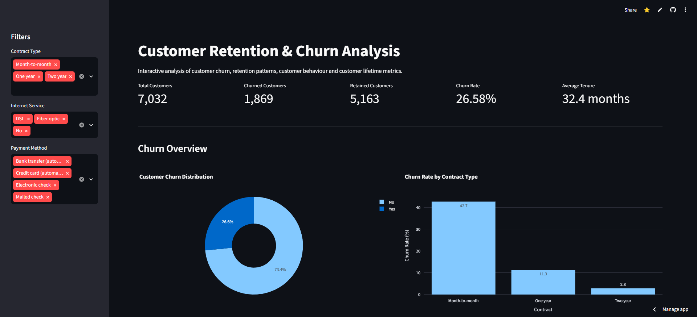
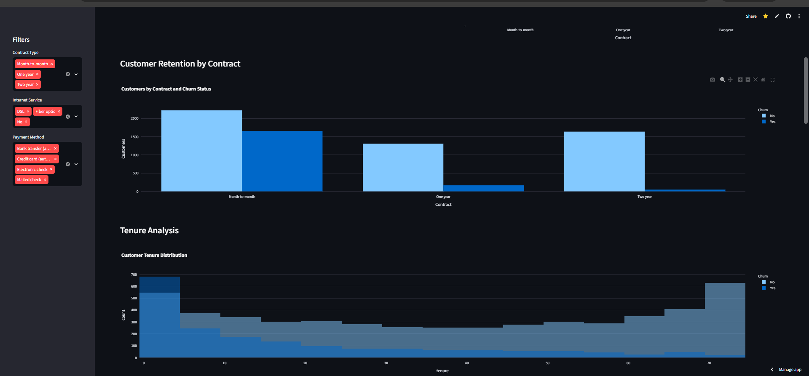
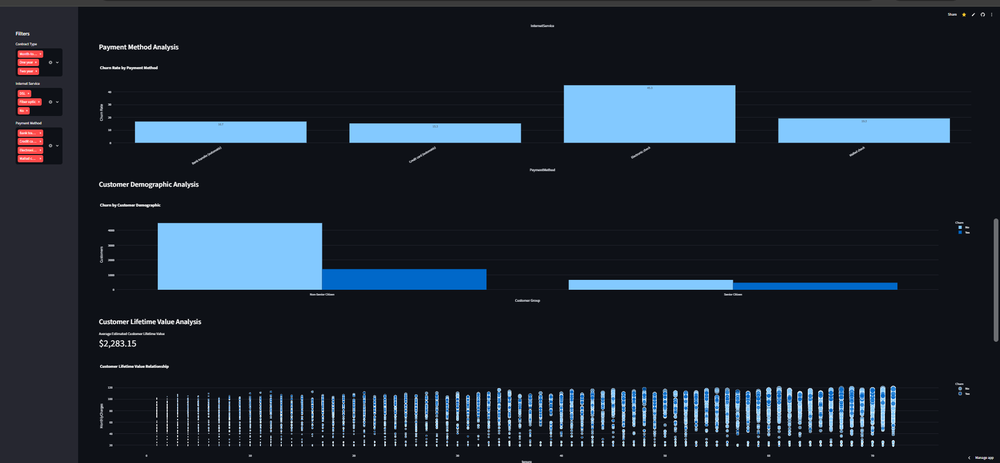
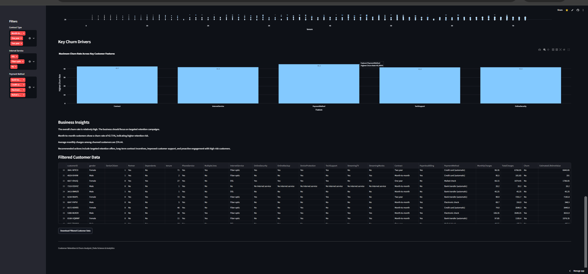

# Customer Retention and Churn Analysis

An interactive Customer Retention and Churn Analysis Dashboard built using Python, Pandas, NumPy, Plotly, and Streamlit to analyze customer churn, retention patterns, customer behavior, service usage, payment methods, tenure, and customer lifetime metrics.

## Live Demo

Live Dashboard:
https://customer-retention-and-churn-analysis-e2kwefdqne3sagv8mge8t8.streamlit.app

GitHub Repository:
https://github.com/Naina137/Customer-Retention-and-Churn-Analysis

---

## Project Overview

Customer churn is one of the major challenges faced by subscription-based businesses. Losing existing customers can affect revenue, customer lifetime value, customer relationships, and long-term business growth.

This project focuses on analyzing customer churn and retention patterns using the Telco Customer Churn dataset.

The application processes and analyzes customer data using Python and Pandas and presents important customer metrics, churn patterns, contract analysis, payment methods, service usage, tenure, customer lifetime metrics, and business insights through an interactive Streamlit dashboard.

The main purpose of this project is to understand customer behavior, identify high-risk customer segments, analyze factors associated with churn, and provide meaningful insights that can support data-driven customer retention strategies.

---

## Problem Statement

Customer churn can have a significant impact on business performance. Businesses need to understand which customers are more likely to leave and what factors may influence their decision.

This project addresses the problem by analyzing customer-level information and identifying patterns related to:

- Customer churn
- Customer retention
- Contract type
- Customer tenure
- Payment methods
- Internet services
- Additional subscribed services
- Customer support
- Monthly charges
- Total charges
- Customer lifetime behavior

The analysis helps identify high-risk customer segments and provides recommendations that businesses can use to improve customer retention.

---

## Objectives

The main objectives of this project are:

- Analyze overall customer churn and retention.
- Calculate important customer performance indicators.
- Identify customer segments with higher churn rates.
- Analyze the relationship between contract type and retention.
- Study customer tenure and churn behavior.
- Analyze payment methods and their relationship with churn.
- Understand internet and additional service usage.
- Analyze customer billing and lifetime metrics.
- Identify important churn drivers.
- Visualize customer behavior through an interactive dashboard.
- Generate meaningful business insights.
- Provide actionable recommendations for improving customer retention.
- Provide an interactive data exploration interface.
- Allow filtered customer data to be downloaded for further analysis.

---

## Key Features

### Key Performance Indicators

The dashboard provides:

- Total Customers
- Churned Customers
- Retained Customers
- Churn Rate
- Retention Rate
- Average Tenure
- Average Monthly Charges
- Average Customer Value
- Customer Lifetime Metrics

### Customer Churn Analysis

The application analyzes:

- Overall churn distribution
- Churned vs retained customers
- Churn rate by contract type
- Churn by internet service
- Churn by payment method
- Churn by customer tenure
- Churn by customer support services

### Retention Analysis

The dashboard helps understand:

- Customer retention patterns
- High-risk customer segments
- Contract-based retention differences
- Tenure-based retention behavior
- Service-related retention patterns

### Customer Behavior Analysis

Customer behavior is analyzed using:

- Contract Type
- Internet Service
- Payment Method
- Technical Support
- Online Security
- Customer Tenure
- Monthly Charges
- Total Charges

### Customer Lifetime Analysis

The project analyzes customer lifetime behavior using:

- Customer Tenure
- Monthly Charges
- Total Charges
- Customer Lifetime Metrics

### Interactive Filters

Users can filter customer data to explore specific customer segments and understand churn patterns.

### Data Explorer

The dashboard provides a detailed view of filtered customer data directly within the application.

### Data Download

Users can download filtered customer data as a CSV file for additional analysis.

### Business Insights

The application provides data-driven business insights and actionable recommendations based on customer churn patterns.

---

## Dashboard Preview

### 1. Main Customer Retention and Churn Dashboard

The main dashboard provides an overview of the customer base and displays important metrics including total customers, churned customers, retained customers, churn rate, and average tenure.

### 2. Retention Analysis

This section analyzes customer retention patterns across different contract types and customer tenure groups.

It helps identify customer groups that may require targeted retention strategies.

### 3. Payment and Service Analysis

This section analyzes payment methods and service-related customer behavior to identify patterns associated with churn and retention.

### 4. Customer Analytics

This section provides additional visualizations for understanding customer tenure, service usage, customer behavior, and other important analytical patterns.

---

## Dataset

The project uses the Telco Customer Churn dataset.

The dataset contains customer-level information related to demographics, account information, subscribed services, billing information, tenure, and churn status.

### Dataset Categories

| Category | Features |
|---|---|
| Customer Information | Customer ID, Gender, Senior Citizen, Partner, Dependents |
| Account Information | Tenure, Contract, Paperless Billing, Payment Method |
| Phone Services | Phone Service, Multiple Lines |
| Internet Services | Internet Service |
| Online Services | Online Security, Online Backup, Device Protection |
| Support Services | Tech Support |
| Streaming Services | Streaming TV, Streaming Movies |
| Billing Information | Monthly Charges, Total Charges |
| Target Variable | Churn |

---

## Data Preparation

The dataset is processed using Python and Pandas before being used in the dashboard.

The data preparation process includes:

1. Loading the customer churn dataset.
2. Inspecting the dataset structure.
3. Cleaning and preparing the data.
4. Handling missing or inconsistent values.
5. Converting numerical columns into appropriate data types.
6. Preparing categorical and numerical variables.
7. Creating churn-related metrics.
8. Preparing data for visualization.
9. Presenting the processed data through Streamlit.

---

## Exploratory Data Analysis

The project performs exploratory analysis across multiple customer attributes.

### Customer Churn Analysis

Customers are categorized into churned and retained groups to understand the overall churn situation.

### Contract Analysis

Different contract types are compared to understand how contract commitment is associated with customer retention.

### Tenure Analysis

Customer tenure is analyzed to identify differences in churn behavior between newer and longer-term customers.

### Payment Method Analysis

Different payment methods are compared to identify possible payment-related churn patterns.

### Internet Service Analysis

Internet service types are analyzed to understand their relationship with customer churn.

### Customer Support Analysis

Technical support and additional services are analyzed to understand their relationship with customer retention.

### Billing Analysis

Monthly charges and total charges are analyzed to understand customer spending patterns and lifetime behavior.

---

## Key Performance Metrics

The dashboard provides important customer metrics including:

- Total Customers
- Churned Customers
- Retained Customers
- Churn Rate
- Retention Rate
- Average Tenure
- Average Monthly Charges
- Average Customer Value
- Customer Lifetime Metrics

These metrics provide a quick overview of the customer retention situation.

---

## Key Analysis Areas

### Customer Churn

The project compares churned and retained customers to understand the overall customer retention situation.

### Contract Type

Different contract types are analyzed to understand their relationship with customer churn and retention.

### Customer Tenure

Customer tenure is studied to identify whether newer or longer-term customers show different churn patterns.

### Payment Methods

Different payment methods are compared to identify possible differences in customer churn behavior.

### Internet and Additional Services

Internet services and additional customer services are analyzed to understand their relationship with customer behavior and retention.

### Customer Lifetime Metrics

Customer tenure, monthly charges, and total charges are analyzed to understand customer lifetime behavior and long-term customer value.

---

## Key Insights

The analysis helps identify several important customer behavior patterns:

- Customer tenure plays an important role in customer retention.
- Customers with shorter tenure can represent a higher-risk churn segment.
- Contract type has a noticeable relationship with customer retention.
- Payment methods can show different churn patterns across customer groups.
- Internet service type can be associated with different churn behavior.
- Customer support and additional services provide useful information about customer retention.
- Monthly charges and total charges help understand customer lifetime behavior.
- Customer account characteristics can help identify potential churn-risk groups.

---

## Business Recommendations

Based on the analysis, businesses can consider the following strategies:

### 1. Focus on High-Risk Customers

Identify customers with higher churn tendencies and target them with personalized retention campaigns.

### 2. Improve Customer Onboarding

Provide additional support, guidance, and engagement during the early stages of the customer relationship.

### 3. Encourage Long-Term Contracts

Provide suitable discounts, loyalty benefits, or incentives to encourage customers to choose longer-term contracts.

### 4. Improve Payment Experience

Make billing and payment processes simple, transparent, reliable, and convenient for customers.

### 5. Personalize Customer Offers

Use customer tenure, service usage, contract type, and billing behavior to create personalized retention offers.

### 6. Strengthen Customer Support

Improve technical support and customer service to increase customer satisfaction and reduce potential churn.

### 7. Monitor Churn Regularly

Continuously monitor churn metrics and customer behavior to identify potential churn before customers leave.

---

## Business Value

This project demonstrates how customer data can be transformed into useful business insights.

The analysis can help businesses:

- Identify customers with higher churn risk.
- Understand factors associated with customer churn.
- Improve customer retention strategies.
- Design targeted customer offers.
- Improve customer engagement.
- Monitor important customer metrics.
- Support data-driven business decisions.
- Develop proactive customer retention strategies.

---

## Technologies Used

| Technology | Purpose |
|---|---|
| Python | Application development |
| Pandas | Data processing and analysis |
| NumPy | Numerical analysis |
| Plotly | Interactive data visualization |
| Streamlit | Interactive dashboard |
| Git | Version control |
| GitHub | Project hosting |
| Streamlit Community Cloud | Application deployment |

---

## Project Workflow

Customer Churn Dataset
        ↓
Data Loading
        ↓
Data Cleaning
        ↓
Data Processing
        ↓
Exploratory Data Analysis
        ↓
Customer Churn Analysis
        ↓
Retention Analysis
        ↓
Data Visualization
        ↓
Interactive Streamlit Dashboard
        ↓
Business Insights
        ↓
Retention Recommendations

---

## Project Structure

Customer-Retention-and-Churn-Analysis/
│
├── app.py
├── WA_Fn-UseC_-Telco-Customer-Churn.csv
├── requirements.txt
├── README.md
├── dashboard.png
├── retention-analysis.png
├── payment-analysis.png
└── customer-analytics.png

---

## How to Run Locally

### Step 1: Clone the Repository

Open your terminal or command prompt and run:

git clone https://github.com/Naina137/Customer-Retention-and-Churn-Analysis.git

### Step 2: Navigate to the Project Folder

cd Customer-Retention-and-Churn-Analysis

### Step 3: Create a Virtual Environment

This step is optional but recommended.

python -m venv venv

For Windows:

venv\Scripts\activate

### Step 4: Install Dependencies

pip install -r requirements.txt

### Step 5: Run the Streamlit Application

streamlit run app.py

The dashboard will open automatically in your default browser.

If it does not open automatically, visit:

http://localhost:8501

Make sure the dataset is present in the project folder before running the application.

---

## Requirements

The project uses the following Python packages:

streamlit
pandas
numpy
plotly

These dependencies are included in the requirements.txt file.

---

## Deployment

The application is deployed using Streamlit Community Cloud.

Live Dashboard:

https://customer-retention-and-churn-analysis-e2kwefdqne3sagv8mge8t8.streamlit.app

The deployed application can be accessed directly through a web browser without installing the project locally.

---

## GitHub Repository

The complete source code, dataset, requirements file, screenshots, and project documentation are available on GitHub.

Repository:

https://github.com/Naina137/Customer-Retention-and-Churn-Analysis

---

## Project Highlights

- Interactive customer churn dashboard
- Customer retention analysis
- Churn rate analysis
- Contract-based analysis
- Tenure analysis
- Payment method analysis
- Internet service analysis
- Customer support analysis
- Customer lifetime analysis
- Customer behavior analysis
- Interactive filters
- Multiple data visualizations
- Business insights
- Actionable recommendations
- Filtered data exploration
- Downloadable customer data
- GitHub documentation
- Streamlit Cloud deployment

---

## Learning Outcomes

Through this project, practical experience was gained in:

- Python programming
- Data cleaning and preprocessing
- Exploratory Data Analysis
- Customer churn analysis
- Customer retention analysis
- Data visualization
- Business analytics
- Dashboard development
- Streamlit application development
- Interactive data presentation
- Git and GitHub
- Cloud deployment
- Data-driven decision making

---

## Use Cases

Customer retention and churn analysis can be useful for:

- Telecom companies
- Subscription-based businesses
- SaaS companies
- Internet service providers
- E-commerce platforms
- Financial services
- Customer support teams
- Marketing teams
- Business analytics teams

---

## Future Improvements

- Machine Learning-based churn prediction
- Customer churn probability scoring
- Customer risk classification
- Automated customer segmentation
- Predictive customer lifetime value
- Personalized retention recommendations
- Advanced predictive analytics
- Real-time customer analytics
- Interactive churn prediction
- Model performance evaluation
- Automated business reports
- Customer-level risk alerts

---

## Conclusion

Customer churn analysis helps businesses understand customer behavior and identify factors that may contribute to customer loss.

This project combines data preparation, exploratory analysis, visualization, and interactive dashboard development to provide a practical view of customer retention and churn.

The Streamlit dashboard makes it easier to explore customer data, identify high-risk customer segments, understand churn patterns, and develop data-driven customer retention strategies.

---

## Author

### Naina Kumari

Computer Science & Engineering — Data Science

Interested in Data Science, Data Analytics, Machine Learning, Business Intelligence, and building practical data-driven applications.

### Connect With Me

GitHub:
https://github.com/Naina137

LinkedIn:
https://www.linkedin.com/in/naina-kumari-06373132b

Live Project:
https://customer-retention-and-churn-analysis-e2kwefdqne3sagv8mge8t8.streamlit.app

Feel free to explore the project, review the source code, or connect with me for collaboration and opportunities.

---

## Feedback and Collaboration

Suggestions and feedback are welcome.

If you have any ideas for improving this project, feel free to open an issue on GitHub or connect with me through LinkedIn.

---

## License

This project is created for educational, internship, learning, and portfolio purposes.
